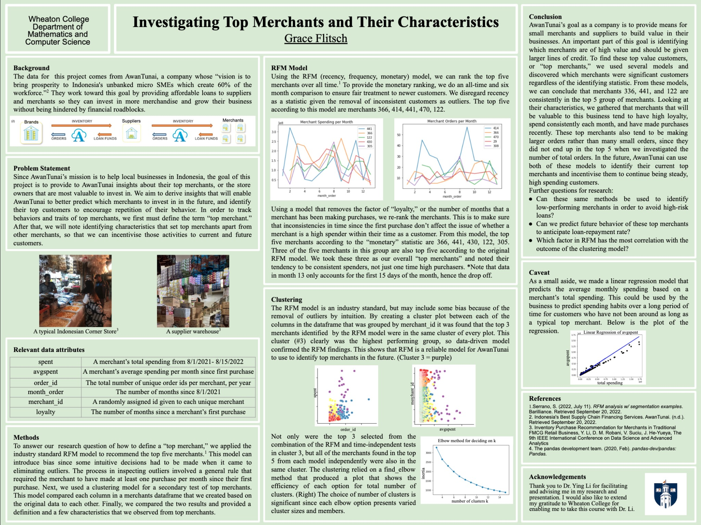

# Personal Portfolio
Hello! I'm a Senior at Wheaton College studying Statistics with a minor in Computer Science. This portfolio showcases the work done in my math and computer science classes over the course of my undergraduate studies.

**Math 465 - Applied Machine Learning:**

[Statistical Missions: Determining a Machine Learning Model of Gospel Access.](https://github.com/graceflitsch/graceflitsch.github.io/blob/main/Statistical-Missions.pdf) 

[Tennis Analytics- Predictive Modeling of ATP Match Data](https://github.com/graceflitsch/graceflitsch.github.io/blob/main/ind_noedit%202.pdf) 

**Math 463 - Mathematical Statistics:**

[A Statistical Analysis of Factors Contributing to Obesity](https://github.com/graceflitsch/graceflitsch.github.io/blob/main/rough--1-.pdf) 

**Math 464 - Mentored Research Seminar in Data Science:**

[Synthesis of Machine Learning Methods for Analyzing Soccer](https://github.com/graceflitsch/graceflitsch.github.io/blob/main/Data_Science_Research_Final%20(1).pdf) 

[Basket Recommender Tool for Indonesian Corner Market Merchants](https://github.com/graceflitsch/basketsrec/blob/main/GNB5.ipynb)

This poster gives an overview of the EDA I conducted on data from AwanTunai, a company that my professor works with. The poster was presented at Wheaton College for the Fall 2022 STEM poster session.

**Computer Science 355: Software Development:**

[Programmar: A speed typing development program and game for coders. ](https://eliouoba.live/ProGrammar/src/webpages/home.html) 

